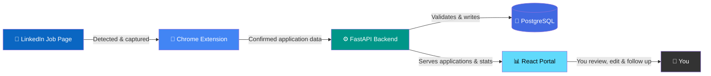

<div align="center">

# 🎯 Job Tracker

### Your job hunt, automatically tracked — starting with LinkedIn.

Job hunting means applying to dozens of roles across weeks, and losing track of half of them is the default outcome — which application needs a follow-up, which recruiter you already messaged, which "Apply" click actually went through. **Job Tracker** removes that guesswork. A lightweight Chrome extension watches your LinkedIn activity in the background, detects the moment an application is actually submitted (not just clicked), and quietly syncs it to a personal dashboard — company, role, location, job description, recruiter contacts, and all — with zero manual data entry.

[](https://fastapi.tiangolo.com/)
[](https://react.dev/)
[](https://www.postgresql.org/)
[](https://developer.chrome.com/docs/extensions/mv3/intro/)
[](https://github.com/jobin2201/Job_Tracker/blob/main/LICENSE)

</div>

<br>

## 📖 Table of Contents

| | | |
|---|---|---|
| [✨ What It Does](#-what-it-does) | [🧩 How It Works](#-how-it-works) | [📊 The Dashboard](#-the-dashboard) |
| [🛠️ Tech Stack](#️-tech-stack) | [🚀 Getting Started](#-getting-started) | [📁 Project Structure](#-project-structure) |
| [🗺️ Roadmap](#️-roadmap) | [📄 Documentation](#-documentation) | [📜 License](#-license) |

<br>

## ✨ What It Does

Every time you open a job on LinkedIn, the extension silently reads the page — job title, company, location, work type, employment type, posting age, applicant count, and the full description — and holds onto a snapshot in memory. It doesn't act on anything yet; it just watches, because LinkedIn is a single-page app that redraws itself constantly, and a naive one-time read would miss half the details.

<p align="center">
  
  <br>
  <sub><b>The extension reads a LinkedIn job page the moment it loads — no button click needed</b></sub>
</p>

The real value kicks in once you actually apply. Whether it's a LinkedIn **Easy Apply** flow or an **External Apply** that sends you off-site, the extension waits for genuine confirmation before recording anything as "applied" — so your tracker never shows an application you didn't actually submit. Along the way it also tries to pull the hiring team or job poster's contact from LinkedIn's own "People you can reach out to" section, so you don't lose that either.

<div align="center">

| 🔎 Detects | 📥 Captures | 🗂️ Organizes | 🔔 Reminds |
|:---:|:---:|:---:|:---:|
| Real Easy Apply & External Apply confirmations — not just clicks | Role, company, location, full description & up to 5 recruiter contacts | Everything into a searchable, filterable, sortable dashboard | Overdue follow-ups and pending confirmations, automatically surfaced |

</div>

<br>

## 🧩 How It Works

Under the hood, three pieces work together, and each one has a narrow, well-defined job:



<div align="center">

| Step | What Happens |
|---|---|
| 1️⃣ **Capture** | You browse a LinkedIn job — the extension quietly reads the role, company, location & description in the background |
| 2️⃣ **Confirm** | You click **Easy Apply** or **Apply** — the extension actively watches for LinkedIn's own "application sent" confirmation before treating it as real |
| 3️⃣ **Sync** | Once confirmed, the extension sends the application to your local FastAPI backend, which validates it and writes it to PostgreSQL |
| 4️⃣ **Track** | The application appears instantly in your dashboard — status, timeline, contacts, and a default follow-up date already set |

</div>

For **Easy Apply**, the extension re-checks the page repeatedly after you hit submit — from 250ms up to 30 seconds later — until it sees LinkedIn's real confirmation message, and only then marks the job as `APPLIED`. For **External Apply**, LinkedIn sends you off to another site the extension has no access to, so it saves the job as `PENDING_CONFIRMATION` and asks you later, when you return to LinkedIn — the same way LinkedIn itself does with "Did you finish applying?".

<p align="center">
  
  <br>
  <sub><b>The extension actively waits for LinkedIn's real confirmation message before marking anything as applied</b></sub>
</p>

<br>

## 📊 The Dashboard

Once an application lands in the system, the React portal is where you actually manage your job search. It's not just a list — every application has its own timeline of events (added, status changed, contact added, follow-up completed), a set of recruiter contacts pulled straight from LinkedIn, editable fields for anything the extension got wrong or couldn't reach, and a follow-up scheduler that quietly reminds you when it's time to reach out again.

<p align="center">
  
  <br>
  <sub><b>Every application, its current status, and what needs attention — all in one view</b></sub>
</p>

Open any single application and you get the full picture: the original job description as captured from LinkedIn, every hiring contact found, a chronological timeline of everything that's happened since you applied, and space for your own notes.

<p align="center">
  
  <br>
  <sub><b>Full timeline, hiring contacts, description & personal notes for a single application</b></sub>
</p>

A notification bell keeps a running count of things that need attention — overdue follow-ups and external applications still awaiting your confirmation — and refreshes automatically as you use the portal, so nothing quietly falls through the cracks.

<br>

## 🛠️ Tech Stack

<div align="center">

| Layer | Technology |
|---|---|
| 🧩 Browser Capture | Chrome Extension · Manifest V3 |
| ⚙️ Backend | FastAPI · Python |
| 🐘 Database | PostgreSQL · Alembic migrations |
| 📊 Frontend | React · TypeScript · Vite |

</div>

<br>

## 🚀 Getting Started

> Runs entirely on your machine — your data never leaves your computer.

### 1️⃣ Backend

```bash
cd backend
python -m venv venv
source venv/bin/activate        # Windows: venv\Scripts\activate
pip install -r requirements.txt
cp .env.example .env            # then fill in your PostgreSQL credentials
alembic upgrade head
uvicorn app.main:app --reload --port 8000
```

### 2️⃣ Frontend

```bash
cd frontend
npm install
npm run dev
```

➡️ Portal will be running at **http://localhost:5173**

### 3️⃣ Extension

The extension is what actually watches LinkedIn and talks to your backend, so it needs to be loaded manually in developer mode — it isn't (yet) on the Chrome Web Store.

<div align="center">

| Step | Action |
|---|---|
| 1 | Open `chrome://extensions` |
| 2 | Enable **Developer mode** (top-right toggle) |
| 3 | Click **Load unpacked** |
| 4 | Select the `extension/` folder |
| 5 | Refresh any LinkedIn tabs that were already open |

</div>

<p align="center">
  
  <br>
  <sub><b>The popup shows connection status to your local backend at a glance</b></sub>
</p>

<div align="center">

### ✅ You're all set — open a LinkedIn job and start applying!

</div>

<br>

## 📁 Project Structure

```
JobTRACKER/
│── .gitignore
│── README.md
│── project_stuructre.txt
│── LICENSE
│
├── backend/          ⚙️  FastAPI · PostgreSQL models · Alembic migrations
│
├── extension/         🧩  Chrome Extension (Manifest V3) — detection & capture logic
│
└── frontend/          📊  React · TypeScript · Vite dashboard
```

<div align="center">

| Folder | Purpose |
|---|---|
| `backend/` | FastAPI app, database models & Alembic migrations |
| `extension/` | Chrome extension — everything that watches LinkedIn and captures applications |
| `frontend/` | The React + TypeScript + Vite dashboard you interact with |

</div>

<br>

## 🗺️ Roadmap

LinkedIn is just the starting point — the same detection-and-sync approach is meant to extend to wherever you're actually applying.

<div align="center">

| Platform | Status |
|---|---|
| 💼 LinkedIn | ✅ Live |
| 🟦 Indeed | 🔜 Planned |
| 🎓 Handshake | 🔜 Planned |
| ➕ More platforms | 🔜 Planned |

</div>

<br>

## 📄 Documentation

This README is deliberately high-level. For the full technical breakdown — exactly how job detection, extraction, deduplication, and syncing work under the hood — see **`implementation.docx`** in the project root.

<br>

## 📜 License

This project is licensed under the MIT License — see [LICENSE](https://github.com/jobin2201/Job_Tracker/blob/main/LICENSE) for details.

<br>

<div align="center">


⭐ **[View on GitHub](https://github.com/jobin2201/Job_Tracker)** ⭐

</div>
