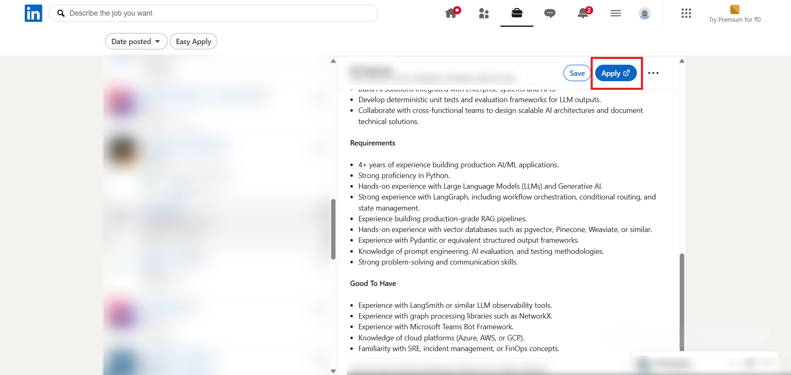
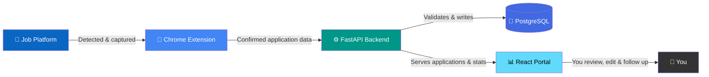
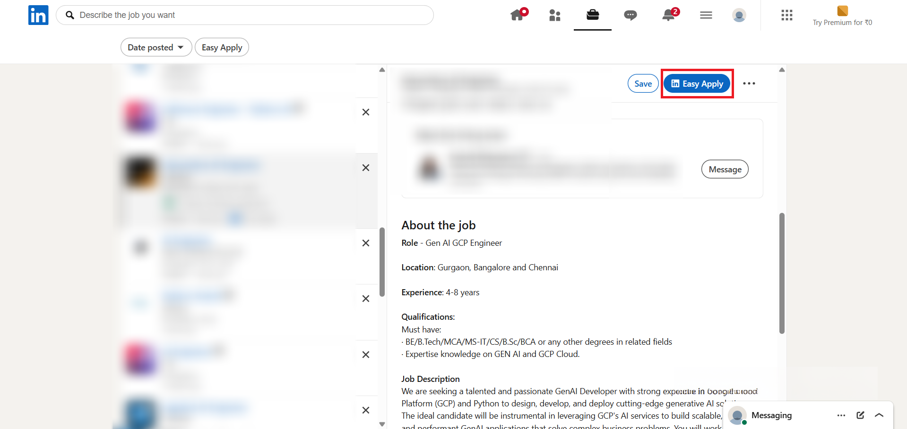
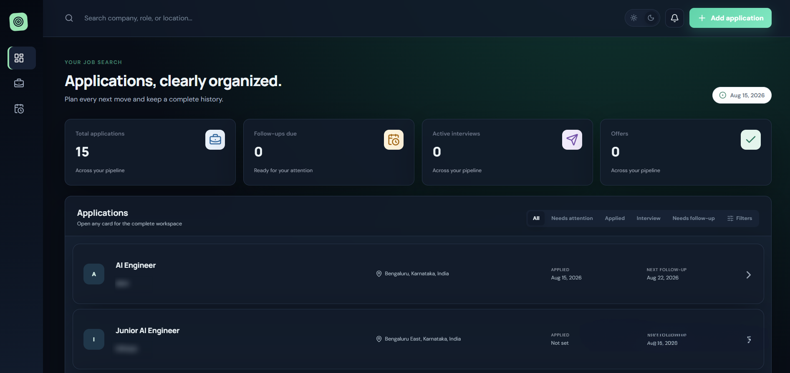
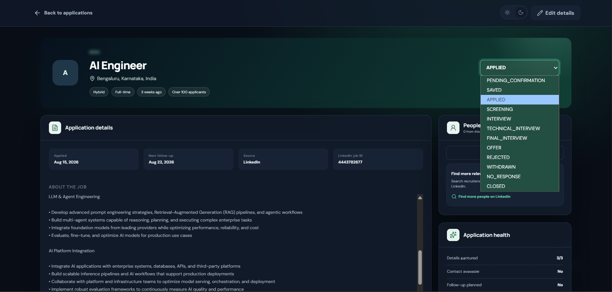
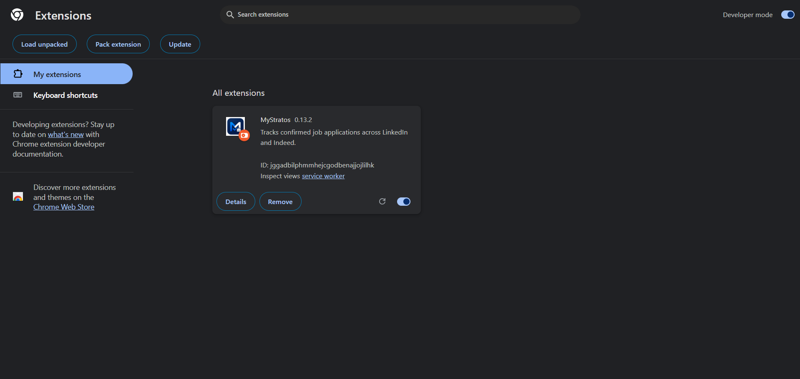

<div align="center">

# 🎯 MyStratos

### Your job hunt, automatically tracked — across LinkedIn and Indeed.

Job hunting means applying to dozens of roles across weeks, and losing track of half of them is the default outcome — which application needs a follow-up, which recruiter you already messaged, which "Apply" click actually went through. **MyStratos** removes that guesswork. A lightweight Chrome extension watches your activity on supported job platforms in the background, detects the moment an application is actually submitted (not just clicked), and quietly syncs it to a personal dashboard — company, role, location, job description, recruiter contacts, and all — with zero manual data entry.

[](https://fastapi.tiangolo.com/)
[](https://react.dev/)
[](https://www.postgresql.org/)
[](https://developer.chrome.com/docs/extensions/mv3/intro/)
[](https://github.com/jobin2201/Job_Tracker/blob/main/LICENSE)

🌐 **[Try MyStratos live](https://mystratos-abc-16d3.vercel.app)**

</div>

<br>

## 📖 Table of Contents

| | | |
|---|---|---|
| [✨ What It Does](#-what-it-does) | [🧩 How It Works](#-how-it-works) | [📊 The Dashboard](#-the-dashboard) |
| [🔐 Multi-User & Security](#-multi-user--security) | [📑 Google Sheets Sync](#-google-sheets-sync) | [🛠️ Tech Stack](#️-tech-stack) |
| [🚀 Getting Started](#-getting-started) | [📁 Project Structure](#-project-structure) | [🗺️ Roadmap](#️-roadmap) |
| [📄 Documentation](#-documentation) | [📜 License](#-license) | |

<br>

## ✨ What It Does

Every time you open a job on a supported platform, the extension silently reads the page — job title, company, location, work type, employment type, posting age, applicant count, and the full description — and holds onto a snapshot in memory. It doesn't act on anything yet; it just watches, because these are single-page apps that redraw themselves constantly, and a naive one-time read would miss half the details.

<p align="center">
  
  <br>
  <sub><b>The extension reads a job page the moment it loads — no button click needed</b></sub>
</p>

The real value kicks in once you actually apply. Whether it's an **Easy Apply** flow or an **External Apply** that sends you off-site, the extension waits for genuine confirmation before recording anything as "applied" — so your tracker never shows an application you didn't actually submit. Along the way it also tries to pull the hiring team or job poster's contact straight from the platform, so you don't lose that either.

<div align="center">

| 🔎 Detects | 📥 Captures | 🗂️ Organizes | 🔔 Reminds |
|:---:|:---:|:---:|:---:|
| Real Easy Apply & External Apply confirmations — not just clicks | Role, company, location, full description & recruiter contacts | Everything into a searchable, filterable, sortable dashboard | Overdue follow-ups and pending confirmations, automatically surfaced |

</div>

<br>

## 🧩 How It Works

Under the hood, three pieces work together, and each one has a narrow, well-defined job:



<div align="center">

| Step | What Happens |
|---|---|
| 1️⃣ **Capture** | You browse a job listing — the extension quietly reads the role, company, location & description in the background |
| 2️⃣ **Confirm** | You click **Easy Apply** or **Apply** — the extension actively watches for the platform's own "application sent" confirmation before treating it as real |
| 3️⃣ **Sync** | Once confirmed, the extension sends the application to your FastAPI backend, which validates it and writes it to PostgreSQL |
| 4️⃣ **Track** | The application appears instantly in your dashboard — status, timeline, contacts, and a default follow-up date already set |

</div>

For **Easy Apply**, the extension re-checks the page repeatedly after you hit submit — from milliseconds up to half a minute later — until it sees a real confirmation message, and only then marks the job as `APPLIED`. For **External Apply**, you're sent off to another site the extension has no access to, so it saves the job as `PENDING_CONFIRMATION` and asks you later, when you return — "Did you finish applying?".

<p align="center">
  
  <br>
  <sub><b>The extension actively waits for a real confirmation message before marking anything as applied</b></sub>
</p>

<br>

## 📊 The Dashboard

Once an application lands in the system, the React portal is where you actually manage your job search. It's not just a list — every application has its own timeline of events (added, status changed, contact added, follow-up completed), a set of recruiter contacts pulled straight from the platform, editable fields for anything the extension got wrong or couldn't reach, and a follow-up scheduler that quietly reminds you when it's time to reach out again.

<p align="center">
  
  <br>
  <sub><b>Every application, its current status, and what needs attention — all in one view</b></sub>
</p>

Open any single application and you get the full picture: the original job description as captured, every hiring contact found, a chronological timeline of everything that's happened since you applied, and space for your own notes.

<p align="center">
  
  <br>
  <sub><b>Full timeline, hiring contacts, description & personal notes for a single application</b></sub>
</p>

A notification bell keeps a running count of things that need attention — overdue follow-ups and external applications still awaiting your confirmation.

<br>

## 🔐 Multi-User & Security

MyStratos isn't a single-user script — it's built so multiple people can use the same backend without ever seeing each other's data.

<div align="center">

| Feature | Details |
|---|---|
| 🔑 Authentication | Google OAuth login — no separate passwords to manage |
| 👥 Data ownership | Every record is scoped to a `user_id`, enforced at the database level |
| 🚧 API isolation | Cross-user data access is blocked at the API layer, not just the UI |

</div>

Sessions are also deliberately short-lived, so a forgotten open tab doesn't stay logged in forever:

<div align="center">

| Mechanism | Duration | What It Does |
|---|:---:|---|
| ⏱️ Inactivity timeout | 15 min | Logs you out if there's no mouse, keyboard, scroll, or touch activity |
| ⏳ Absolute session limit | 60 min | Hard ceiling on a login, even while you're continuously active |
| 🔄 Browser session window | 30 min | Rolling session token lifetime |
| 🧩 Extension token | 30 min | Forces the extension to re-authenticate independently of the dashboard |
| 🚫 Background polling | — | Does **not** count as activity — an idle tab quietly polling the API will still time out |

</div>

In short: staying active (moving your mouse, scrolling, typing) keeps you logged in past the 15-minute mark, but nothing keeps you logged in past 60 minutes — at that point you'll need to sign in again with Google.

<br>

## 📑 Google Sheets Sync

Every user can connect their own Google account to get a personal, always-up-to-date spreadsheet mirror of their applications — useful for sharing, offline review, or just having a backup outside the dashboard.

<div align="center">

| Feature | Details |
|---|---|
| 📄 Per-user spreadsheets | Each authenticated user gets their own separate Google Sheet |
| 🔁 Sync frequency | Automatic background sync every 5 minutes |
| 🔐 Token storage | Google refresh tokens are stored encrypted, never in plain text |
| 🔂 Failure handling | Failed syncs support manual retry |

</div>

Because the sync timer starts when the backend starts and runs on a fixed 5-minute cycle, a newly captured application typically appears in your linked spreadsheet within 0–5 minutes, depending on how recently the last cycle ran.

<br>

## 🛠️ Tech Stack

<div align="center">

| Layer | Technology |
|---|---|
| 🧩 Browser Capture | Chrome Extension · Manifest V3 |
| ⚙️ Backend | FastAPI · Python |
| 🐘 Database | PostgreSQL · Alembic migrations |
| 📊 Frontend | React · TypeScript · Vite |
| 🔑 Auth | Google OAuth |
| 📑 Sync | Google Sheets API |

</div>

<br>

## 🚀 Getting Started

### 1️⃣ Backend

```bash
cd backend
python -m venv venv
source venv/bin/activate        # Windows: venv\Scripts\activate
pip install -r requirements.txt
cp .env.example .env            # then fill in your PostgreSQL & Google OAuth credentials
alembic upgrade head
```

### 2️⃣ Extension

The extension is what actually watches job platforms and talks to your backend, so it needs to be loaded manually in developer mode — it isn't (yet) on the Chrome Web Store.

<div align="center">

| Step | Action |
|---|---|
| 1 | Open `chrome://extensions` |
| 2 | Enable **Developer mode** (top-right toggle) |
| 3 | Click **Load unpacked** |
| 4 | Select the `extension/` folder |
| 5 | Refresh any relevant job-platform tabs that were already open |

</div>

<p align="center">
  
  <br>
  <sub><b>The popup shows connection status to your backend at a glance</b></sub>
</p>

### 3️⃣ Run the app — two terminals

<div align="center">

**Terminal 1 — Backend**

```bash
cd backend
python -m uvicorn app.main:app --host 127.0.0.1 --port 8000
```

**Terminal 2 — Frontend**

```bash
cd frontend
npm install
npm run dev -- --host 127.0.0.1
```

</div>

➡️ Open **http://127.0.0.1:5173** and sign in with Google to get started.

Both terminals need to stay open while you use the app — the backend also runs the Google Sheets sync worker in the background, so there's nothing extra to run.

<br>

## 📁 Project Structure

```
MyStratos/
│── .gitignore
│── README.md
│── project_structure.txt
│── LICENSE
│
├── backend/            ⚙️  FastAPI app
│   ├── app/
│   │   ├── authentication/         🔑  Google OAuth, sessions & security
│   │   └── integrations/
│   │       └── google_sheets/      📑  Per-user Sheets sync
│   └── migrations/                 🐘  Alembic database migrations
│
├── extension/           🧩  Chrome Extension (Manifest V3)
│   ├── linkedin/
│   ├── indeed/
│   └── handshake/                  🔜  Coming soon
│
├── frontend/            📊  React · TypeScript · Vite dashboard
│   └── src/
│       ├── authentication/
│       └── integrations/google-sheets/
│
├── google_sheets_mirror/  📄  Optional standalone Sheets mirror utility
│
└── screenshots/
```

<div align="center">

| Folder | Purpose |
|---|---|
| `backend/` | FastAPI app, database models, Google OAuth authentication, Google Sheets integration & Alembic migrations |
| `extension/` | Chrome extension — LinkedIn & Indeed detection today, with Handshake support on the way |
| `frontend/` | The React + TypeScript + Vite dashboard, including authentication & Sheets integration UI |
| `google_sheets_mirror/` | Optional standalone utility for mirroring data to Sheets outside the main sync worker |

</div>

<br>

## 🗺️ Roadmap

<div align="center">

| Platform | Status |
|---|---|
| 💼 LinkedIn | ✅ Live |
| 🟦 Indeed | ✅ Live |
| 🎓 Handshake | 🔜 Planned |
| ➕ More platforms | 🔜 Planned |

</div>

<br>

## 📄 Documentation

This README is deliberately high-level. For the full technical breakdown — exactly how job detection, extraction, deduplication, and syncing work under the hood — see **`implementation.docx`** in the project root.

<br>

## 📜 License

This project is licensed under the MIT License — see [LICENSE](https://github.com/jobin2201/Job_Tracker/blob/main/LICENSE) for details.

<br>

<div align="center">

⭐ **[View Live](https://mystratos-abc-16d3.vercel.app)** ⭐

</div>
